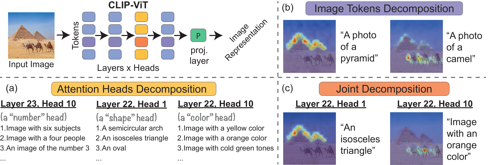

## Interpreting CLIP's Image Representation via Text-Based Decomposition
Official PyTorch Implementation

### [Paper](https://arxiv.org/abs/2310.05916) | [Project Page](https://yossigandelsman.github.io/clip_decomposition/)

[Yossi Gandelsman](https://yossigandelsman.github.io/), [Alexei A. Efros](https://people.eecs.berkeley.edu/~efros/) and [Jacob Steinhardt](https://jsteinhardt.stat.berkeley.edu/)



### Setup
We provide an [`environment.yml`](environment.yml) file that can be used to create a Conda environment:

```bash
conda env create -f environment.yml
conda activate prsclip
```
### Preprocessing
To obtain the projected residual stream components for the ImageNet validation set, including the contributions from multi-head attentions and MLPs, please run one of the following instructions:

```bash
python compute_prs.py --dataset imagenet --device cuda:0 --model ViT-H-14 --pretrained laion2b_s32b_b79k --data_path <PATH>
python compute_prs.py --dataset imagenet --device cuda:0 --model ViT-L-14 --pretrained laion2b_s32b_b82k --data_path <PATH>
python compute_prs.py --dataset imagenet --device cuda:0 --model ViT-B-16 --pretrained laion2b_s34b_b88k --data_path <PATH>
```

To obtain the precomputed text representations of the ImageNet classes, please run:
```bash
python compute_text_projection.py  --dataset imagenet --device cuda:0 --model ViT-H-14 --pretrained laion2b_s32b_b79k
python compute_text_projection.py  --dataset imagenet --device cuda:0 --model ViT-L-14 --pretrained laion2b_s32b_b82k
python compute_text_projection.py  --dataset imagenet --device cuda:0 --model ViT-B-16 --pretrained laion2b_s34b_b88k
```

### Mean-ablations
To verify that the MLPs and the attention from the class token to itself can be mean-ablated, please run:

```bash
python compute_ablations.py --model ViT-H-14
python compute_ablations.py --model ViT-L-14
python compute_ablations.py --model ViT-B-16
```

### Convert text labels to representation 
To convert the text labels for <i>TextSpan</i> to CLIP text representations, please run:

```bash
python compute_text_set_projection.py --device cuda:0 --model ViT-L-14 --pretrained laion2b_s32b_b82k --data_path text_descriptions/google_3498_english.txt
python compute_text_set_projection.py --device cuda:0 --model ViT-L-14 --pretrained laion2b_s32b_b82k --data_path text_descriptions/image_descriptions_general.txt
```

### ImageNet segmentation
Please download the dataset from [here](http://calvin-vision.net/bigstuff/proj-imagenet/data/gtsegs_ijcv.mat):

```bash
mkdir imagenet_seg
cd imagenet_seg
wget http://calvin-vision.net/bigstuff/proj-imagenet/data/gtsegs_ijcv.mat
```

To get the evaluation results, please run:

```bash
python compute_segmentations.py --device cuda:0 --model ViT-H-14 --pretrained laion2b_s32b_b79k --data_path imagenet_seg/gtsegs_ijcv.mat --save_img
python compute_segmentations.py --device cuda:0 --model ViT-L-14 --pretrained laion2b_s32b_b82k --data_path imagenet_seg/gtsegs_ijcv.mat --save_img
python compute_segmentations.py --device cuda:0 --model ViT-B-16 --pretrained laion2b_s34b_b88k --data_path imagenet_seg/gtsegs_ijcv.mat --save_img
```
Save the results with the `--save_img` flag.


### TextSpan

To find meaningful directions for all the attenion heads, run:
```bash
python compute_complete_text_set.py --device cuda:0 --model ViT-B-16 --texts_per_head 20 --num_of_last_layers 4 --text_descriptions image_descriptions_general
python compute_complete_text_set.py --device cuda:0 --model ViT-L-14 --texts_per_head 20 --num_of_last_layers 4 --text_descriptions image_descriptions_general
python compute_complete_text_set.py --device cuda:0 --model ViT-H-14 --texts_per_head 20 --num_of_last_layers 4 --text_descriptions image_descriptions_general
```

### Other datasets
To download the Waterbirds datasets, run:
```bash
wget https://nlp.stanford.edu/data/dro/waterbird_complete95_forest2water2.tar.gz
tar -xf  waterbird_complete95_forest2water2.tar.gz
```
To compute the overall accuracy, run:
```bash
python compute_prs.py --dataset binary_waterbirds --device cuda:0 --model ViT-L-14 --pretrained laion2b_s32b_b82k --data_path <PATH>
python compute_text_projection.py  --dataset binary_waterbirds --device cuda:0 --model ViT-L-14 --pretrained laion2b_s32b_b82k
python compute_use_specific_heads.py --model ViT-L-14 --dataset binary_waterbirds 
```

### Spatial decomposition
Please see a demo for the spatial decomposition of CLIP in `demo.ipynb`. 


### Nearest neighbors search
Please see the nearest neighbors search demo in `nns.ipynb`.

### BibTeX

```bibtex
@inproceedings{
      gandelsman2024interpreting,
      title={Interpreting {CLIP}'s Image Representation via Text-Based Decomposition},
      author={Yossi Gandelsman and Alexei A. Efros and Jacob Steinhardt},
      booktitle={The Twelfth International Conference on Learning Representations},
      year={2024},
      url={https://openreview.net/forum?id=5Ca9sSzuDp}
}
```
